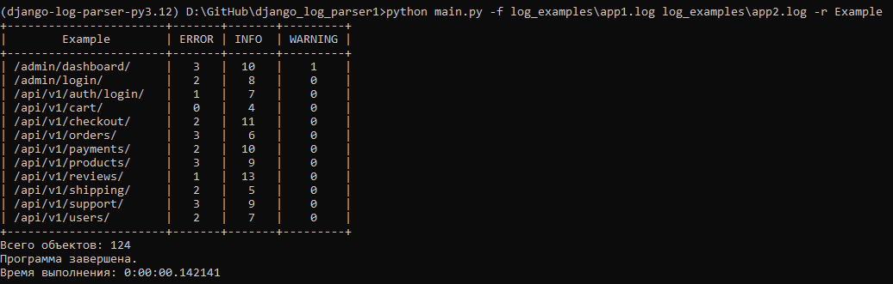
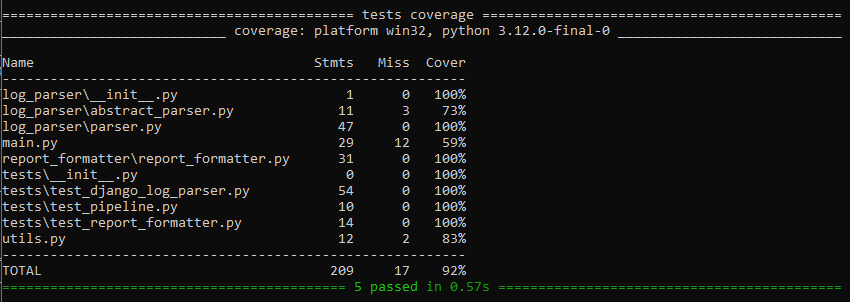
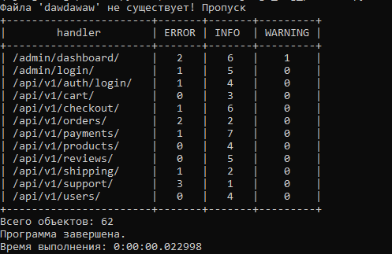
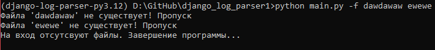

# Django log parser

## Структура проекта

```
.
└── django_log_parser/
    ├── log_examples      # Примеры файлов логов
    ├── log_parser        # Парсеры логов/
    │   ├── abstract_parser.py # Абстрактный класс парсеров
    │   └── parser.py          # Реализация парсеров
    ├── report_formatter  # Формирователь отчетов
    ├── tests             # Тесты
    ├── main.py           # Главный файл запуска
    └── utils.py          # Вспомогательные функции
```

## Требования

* *Python 3.12*
* *Poetry (для загрузки pytest)*

## Запуск проекта

**Требуемые** зависимости для теста

1. `pytest`
2. `pytest-cov`

### Установка зависимостей

```apache
poetry shell
poetry install
```

Запускать проект **без тестов** можно без установки зависимостей.

### **Аргументы принимаемые на вход:**

```apache
py main.py -h
usage: main.py [-h] [-f FILENAMES [FILENAMES ...]] [-r REPORT]

options:
  -h, --help            show this help message and exit
  -f FILENAMES [FILENAMES ...], --filenames FILENAMES [FILENAMES ...]
                        Файлы логов
  -r REPORT, --report REPORT
                        Название отчета
```

При запуске проводится проверка на существование файлов, поданных на вход. При отсутвии аргумента `--report` название отчета принимает значение по умолчанию - `handler`

### Пример запуска

```apache
python main.py -f log_examples\app1.log log_examples\app2.log -r Example
```

#### Вывод прогаммы



Для того, чтобы поменять объекты группирвки и объекты подсчета, необходимо поменять строчки в файле `main.py`

```python
group_by_object = combined_logs["routes"]
object_to_count = combined_logs["logger_statuses"]
```

### Тесты

Тесты покрывают **92%** кода проекта и включают все комбинации объектов группировки.

#### Запуск тестов с покрытием:

```apache
pytest --cov=. -s
```



### Дополнительная информация

Класс парсера (`log_parser/parser.py/DjangoRequestLogParser()`)) построен таким образом, что при желании можно разработать по образу и подобию парсер под другой тип логов (в данном случае   `django.requests`), в выводе которого получаем **объект типа:**

```json
{
   'logger_statuses': ["ERROR", ...],
   'methods': ["GET", "PUT", ...],
   'sources': ["192.168.0.1", ...],
   'datetime': ["2025-03-28 12:11:57", ...],
   'routes': ["/admin/dashboard/", ...],
   'responses': ["201", ...]
}
```

Класс `report_fomatter/report_formatter/ReportFormatter()` позволяет дописать логику формирования отчетов на основе данных полученных от парсера.

### Другие примеры запуска

```apache
python main.py -f dawdawaw log_examples\app1.log
```



```apache
python main.py -f dawdawaw ewewe
```


